## 一、前置准备

### 所需必备环境如下

- **Node.js**：关键运行环境
- **pnpm**：包管理工具，使用npm安装
- **GitHub Desktop**：github官方客户端
- **Git**：版本控制，用于拉取、提交代码
- **VS Code**：编辑器，用于修改配置、写文章

### 安装Node.js

推荐安装LTS稳定版，版本需要 ≥ 22,选择msi即可

[Node.js官网](https://nodejs.org/zh-cn/download)

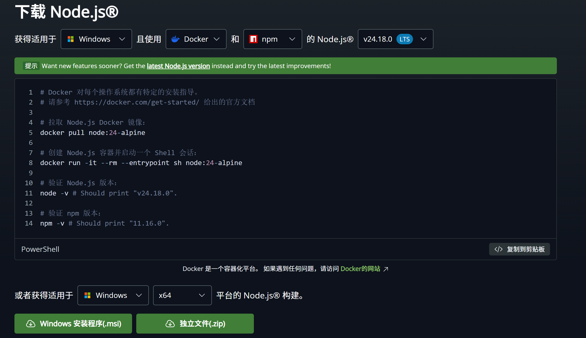

下载完成后进行安装，默认选项直接下一步即可。随后我们打开终端窗口，执行以下命令验证版本号是否正确

```js
node -v
npm -v
```

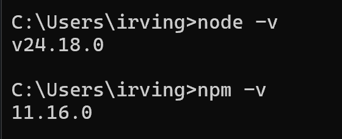

### 安装pnpm

```js
npm install -g pnpm
pnpm -v
```

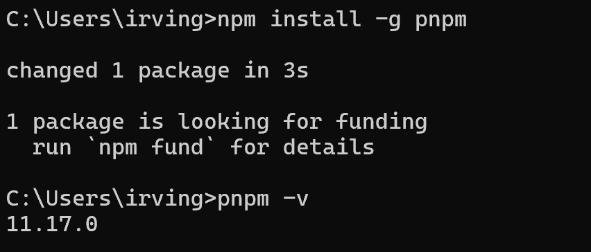

ps:第一次装结果是**added 1 package**

### 安装git

下载最新版并安装即可

[git官网](https://git-scm.cn/install/windows)

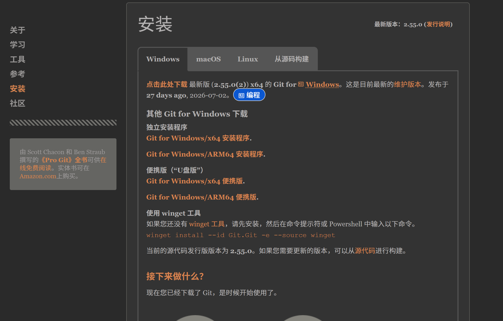

### 安装VS Code
如果您有其他选择，也可以安装其他的

[VScode官网](https://code.visualstudio.com/Download)

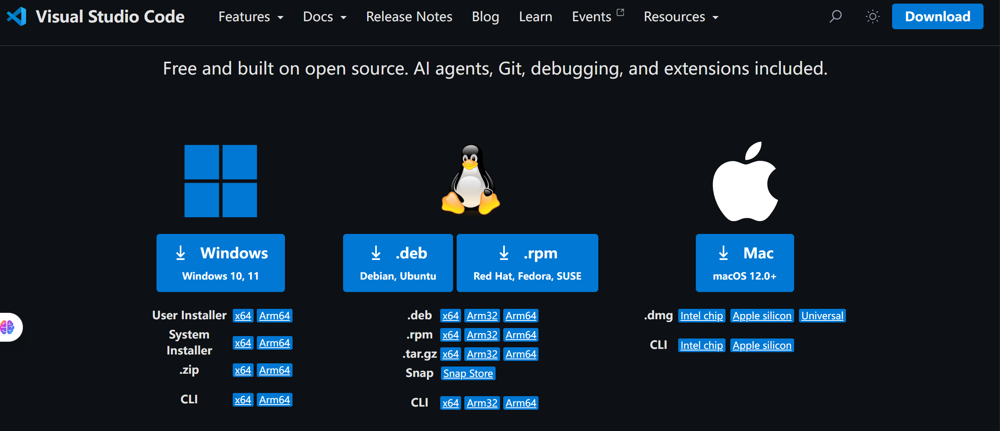

根据您的系统选择就行

## 二、Fork模板官方仓库

打开您选择的模板官方仓库(我这里选的是FireFly):

::github{repo="CuteLeaf/Firefly"}

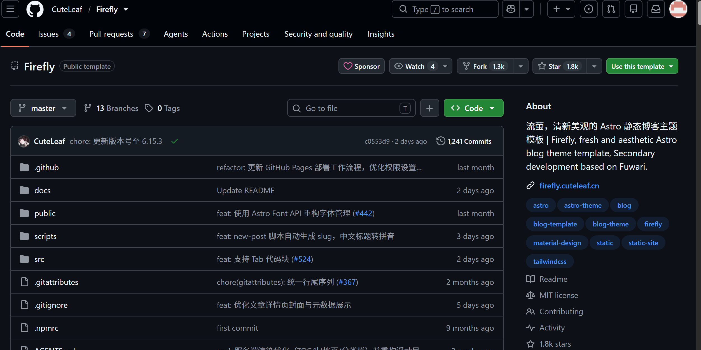

点击右上角的**Fork**按钮

填写信息后，点击**Create Fork**后，会自动跳转到你自己的仓库

## 三、克隆仓库并修改配置

现在我们已经拥有了Firefly 仓库，需要将它的代码克隆到本地，进行修改配置，编写文档等

### 克隆并本地运行
打开GitHub Desktop 搜索仓库的名字后，点击下方的**Clone**按钮拉取代码

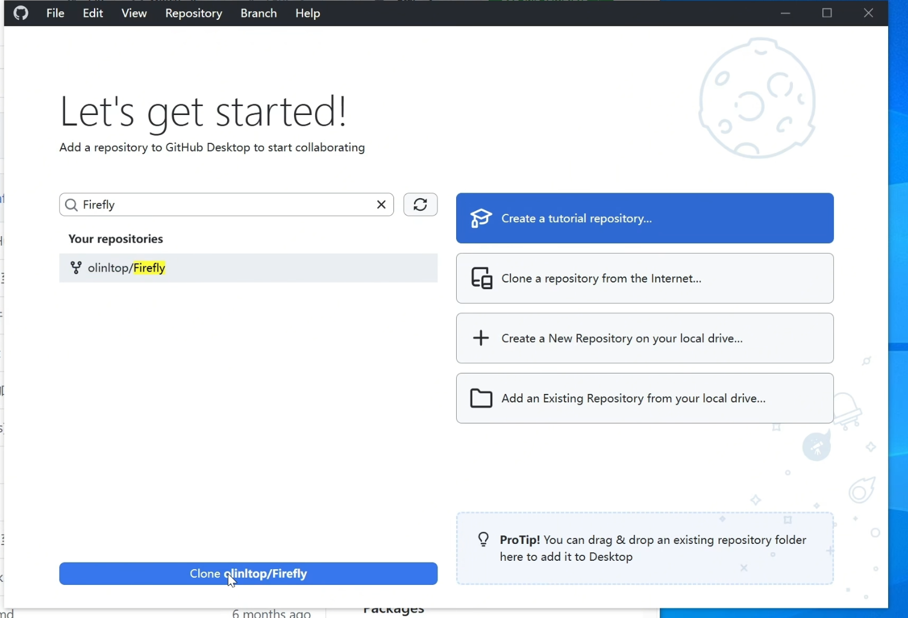

ps:我已经载入仓库了，所以启动页的图是盗的

然后选择一个本地的目录存储

然后在code打开项目

点击顶部的**终端**，新建终端，然后在新打开的终端输入下面的命令进行安装依赖
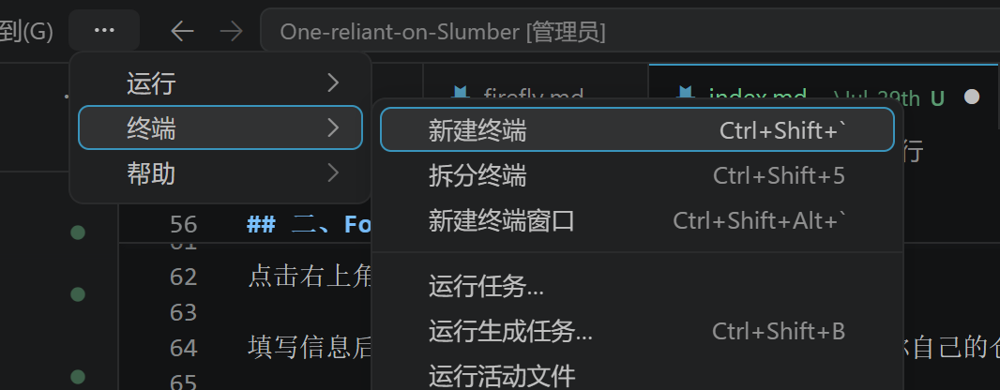
```js
pnpm install
```

启动本地预览

```js
pnpm dev
```

等待10-30秒，终端显示访问地址： [http://localhost<4321>](http://localhost<4321>)

打开浏览器输入该地址，看到Firefly默认首页，即本地搭建成功

### 修改关键配置
点击左侧目录树，配置文件夹：src/config/

这里可以根据官网文档自定义你的站点：[https://docs-firefly.cuteleaf.cn/zh/guide/site.html](https://docs-firefly.cuteleaf.cn/zh/guide/site.html)

### 如何编写文章

点击左侧目录，文章文件夹：src/content/posts/

文章使用**Markdown**格式

最上面是文章的属性信息

具体可以参考官网文档：[https://docs-firefly.cuteleaf.cn/zh/guide/writing.html](https://docs-firefly.cuteleaf.cn/zh/guide/writing.html)

### 上传Github
我们在修改完配置，编写完文章后，要将相关的代码上传到GitHub，这里使用Git工具上传，有3种方式

**1、Github Desktop**

我们在 GitHub Desktop 勾选需要提交的文件，在下面输入提交消息，然后点击commit 按钮 然后点击上方的Psuh origin

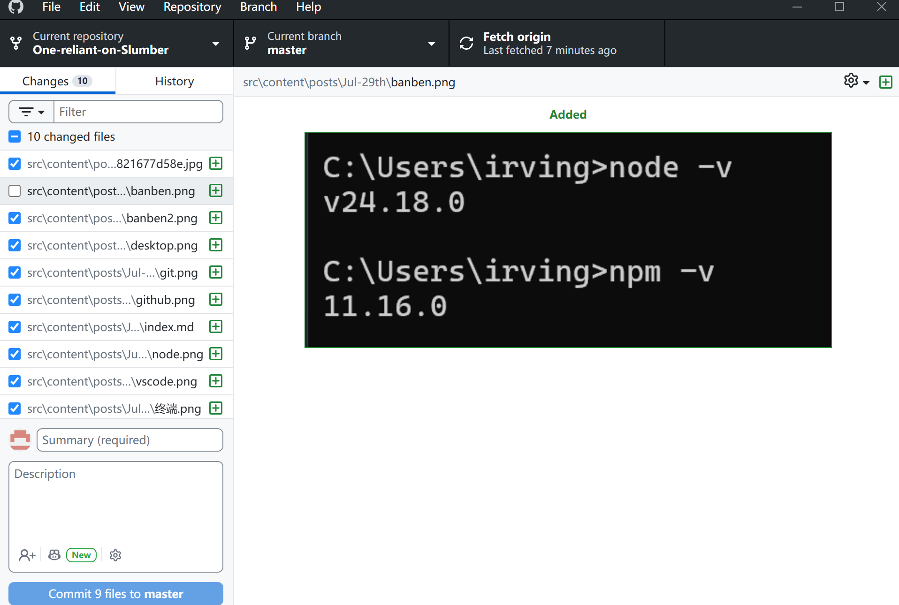

**2、使用VS Code**

VS Code 左侧有一个源代码管理，在这里可以上传代码，写消息，查看历史变更等

只需要右键需要提交的文件，点击添加到暂存更改，填入消息之后点击提交按钮，随后点击推送，即可成功推送

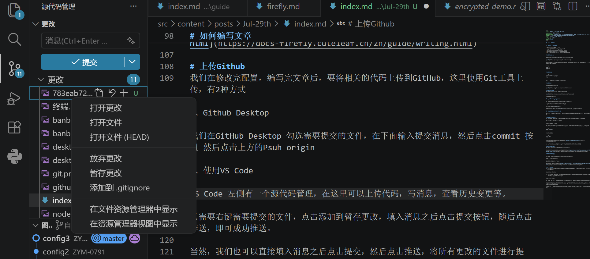

当然，我们也可以直接填入消息之后点击提交，然后点击推送，将所有更改的文件进行提交

**3、或者，我们也可以使用git命令**

```js
git add .
git commit -m "更新内容"
git push
```

## 四、部署站点
上面我们已经把自己的代码同步到了GitHub，我们需要让部署程序去关联 GitHub，并自动构建部署，发布到互联网

这一步的选择有许多，我们提供**Cloudflare Workers**，绑定域名无需备案

### 部署到Cloudfare Workers

**检查配置文件**

由于我们是要部署到 Cloudflare，需要确保项目里的 Worker **配置文件**正确

在项目根目录找到 wrangler.jsonc，确认内容大致如下：

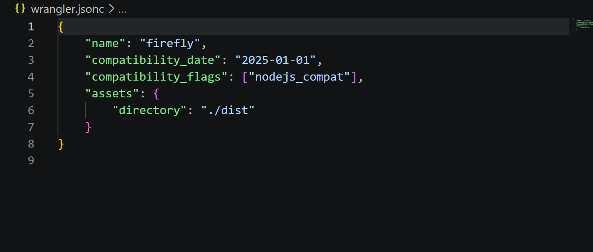

**新建 Cloudflare Worker 应用**

1.**登录 Cloudflare 控制台** 打开浏览器访问[官方控制台](https://dash.cloudflare.com/)，输入账号密码完成登录

2.**进入Workers & Pages页面** 登录后，在左侧菜单栏找到并点击 Workers 和 Pages（英文对应：Workers & Pages），进入应用管理页面

3.**创建应用程序** 在页面右上角，点击 创建应用程序（英文对应：Create application），进入应用创建流程

4.**关联 GitHub 代码仓库** 在创建页面中，选择连接到 Git（Connect Git），然后选中 GitHub，按照页面提示完成授权，允许 Cloudflare 访问你的 GitHub 账号

5.**选择目标仓库授权** 完成后，系统会列出你的 GitHub 所有仓库，从中选中需要部署到 Cloudflare Worker 的代码仓库（如 Firefly 仓库）

6.**配置构建设置** ：

- Build command: pnpm build

- Deploy command: npx wrangler deploy

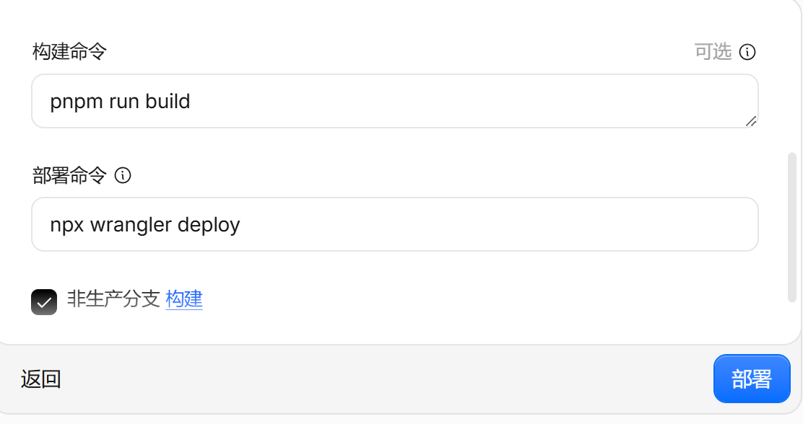

发起首次部署 配置完成后，点击页面底部的 **部署（Deploy）**，启动首次自动部署流程

等待自动构建完成 Cloudflare 会自动执行三个操作：拉取 GitHub 仓库代码 → 执行构建命令 → 将项目部署至 Workers 服务器，耐心等待即可

当构建状态显示“成功”后，点击 Worker 项目顶部的 **临时域名**（格式为：xxx.workers.dev）。

打开浏览器访问该临时域名，若页面展示效果与本地预览的博客首页完全一致，说明 Cloudflare Worker 与 GitHub 自动部署配置成功

**绑定域名**

因为Worker提供的域名，在国内SNI封禁的情况下可能会无法访问。所以，我们需要绑定一个自己的域名

域名可以自行在腾讯云或阿里云购买，新客价格都很便宜


拥有域名就可以将域名连接到Cloudflare,点击添加域名->链接域名

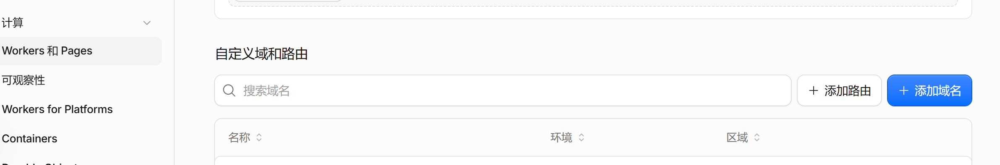

继续然后选择免费计划即可(作为个人博客，免费计划足以正常使用)

去购买域名的地方，找到**域名管理**,进行DNS修改，将Claudflare提供的DNS输入即可

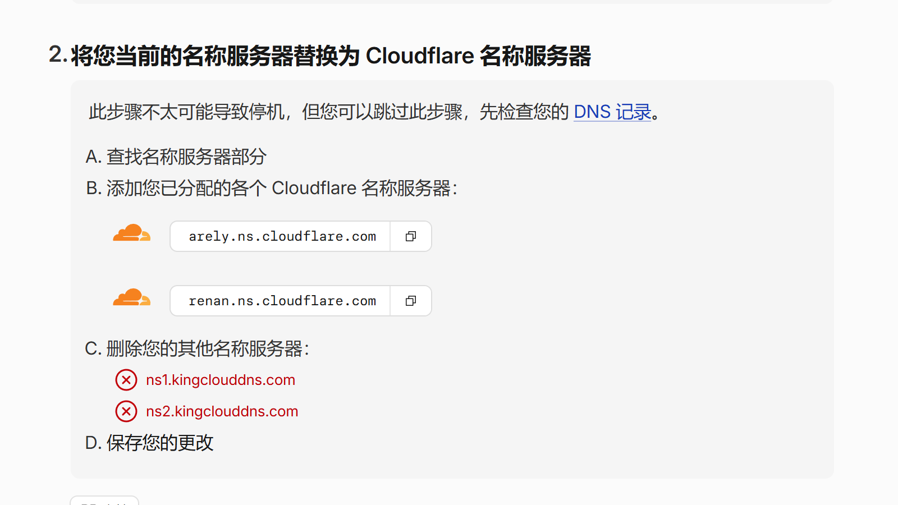

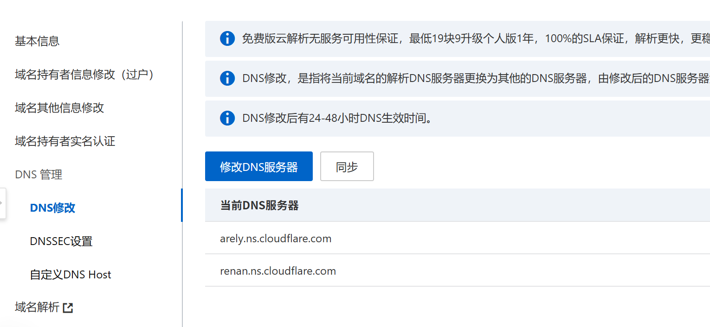

点击**我已更新名称服务器**，等待核验完成

核验完成后，回到works and pages点击**域**添加域名


添加完成后，就能使用自定义域名访问了