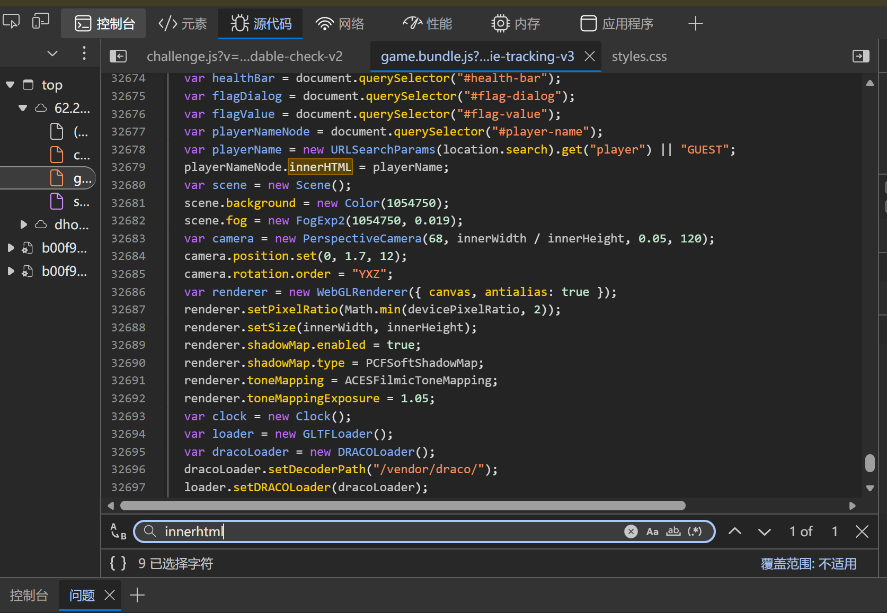
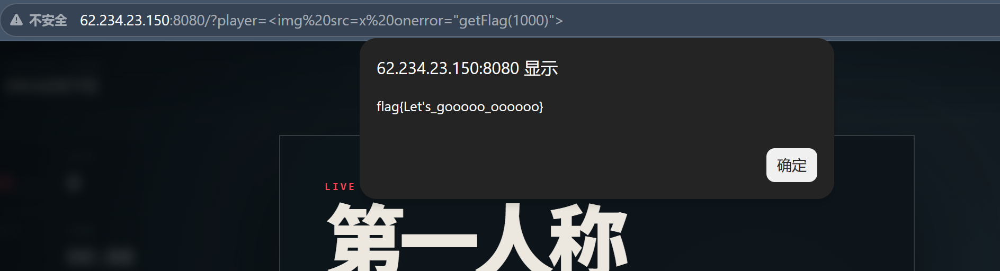

> 接着上一篇控制台解法，这篇记录 URL 注入的完整思路。其实和我昨天想的不一样，找入口没那么麻烦，有简单粗暴的方法，没和昨天写在同一篇的原因是，昨天还没想好怎么总结这一类题的思路

依旧是[http://62.234.23.150:8080/](http://62.234.23.150:8080/)

## 一、怎么找入口

### 1.1 千万千万别一行行读源码，用搜索

之前我觉得找 XSS 入口要一行行读 `game.bundle.js`，其实根本不用，这个文件有几万行，看到眼瞎也找不到。实战里直接**搜索关键词**就行

在开发者工具里按 **F12**，切到 **Sources**（源代码）标签页，打开 `challenge.js` 或 `game.bundle.js`，然后按 **Ctrl + F**，搜这几个词：

| 搜什么 | 为什么 |
|---|---|
| `innerHTML` | 最常见的 XSS 注入点，把字符串当 HTML 解析 |
| `outerHTML` | 同上，也是危险 sink |
| `document.write` | 老牌危险函数，直接往页面写内容 |
| `insertAdjacentHTML` | 也是按 HTML 解析写入 |
| `location.search` | URL 查询参数，常见的"数据来源" |
| `location.hash` | URL 锚点（#后面），也是数据来源 |
| `URLSearchParams` | 读 URL 参数的 API |

> ps：不用全搜，挑 `innerHTML` 和 `location.search` 这俩搜就行，命中率高得离谱。本题搜 `innerHTML` 直接就跳到那三行了。

### 1.2 本题搜出来的结果

搜 `innerHTML`，直接定位到这几行：

```js
var playerNameNode = document.querySelector("#player-name");
var playerName = new URLSearchParams(location.search).get("player") || "GUEST";
playerNameNode.innerHTML = playerName;
```



这什么意思：

1. **数据从哪来？** → `URLSearchParams(location.search).get("player")` —— 从 URL 的 `?player=` 参数来，**我们能控制**
2. **数据去了哪？** → `innerHTML = playerName` —— 直接写进 HTML，**没过滤**，说明找对了

人能改的数据，会进没过滤的 `innerHTML`，这就是关键点，找完了

## 二、构造 payload

### 2.1 为什么不能用 `<script>`

最先想的肯定是注入 `<script>getFlag(1000)</script>`，但试了发现没用。原因是：**通过 `innerHTML` 插入的 `<script>` 标签，浏览器不会执行**。这是浏览器的安全规范，不是 bug

所以得换个能自动触发 JS 的标签

### 2.2 用 ``

最经典的绕过方式：

```html

```

原理很简单：
- `` —— 加载一个叫 `false` 的图片，肯定加载失败
- `onerror="getFlag(1000)"` —— 加载失败时自动执行这段 JS

不需要用户点任何东西，图片加载失败是自动的，`onerror` 就自动触发了

### 2.3 还有别的载体吗

有的兄弟有的，常见的几种：

| 载体 | 触发方式 | 需要用户点击吗 |
|---|---|---|
| `` | 图片加载失败 | 否，自动 |
| `<svg onload=...>` | SVG 加载完成 | 否，自动 |
| `<input onfocus=... autofocus>` | 输入框自动聚焦 | 否，自动 |
| `<details open ontoggle=...>` | 展开/折叠事件 | 否，自动 |

`` 最短，第一个试它就行

## 三、把 payload 写进 URL

### 3.1 为什么要编码

payload 是 ``，里面有一堆特殊字符：`< > " ( )`。这些字符在 URL 里有特殊含义，直接拼进去浏览器会解析错乱。

所以要**URL 编码**——把特殊字符换成 `%` 加十六进制。

### 3.2 编码对照表

只需要记住这几个常用的：

| 字符 | 编码 |
|---|---|
| `<` | `%3C` |
| `>` | `%3E` |
| 空格 | `%20`（或 `+`） |
| `"` | `%22` |
| `(` | `%28` |
| `)` | `%29` |
| `=` | `%3D` |

### 3.3 手动编码太麻烦？

**让浏览器帮你编码**

在浏览器地址栏直接输入未编码的 payload：
```
http://62.234.23.150:8080/?player=
```
回车后浏览器会自动编码，地址栏就变成编码后的样子了。复制地址栏的 URL 就是现成的攻击链接



> ps：有些浏览器会自动把 `< >` 编码，有些不会。但浏览器有容错能力，我经过尝试，这里就算没编也可以，所以大胆试错了再改

### 3.4 最终的攻击 URL

编码后拼出来的完整 URL：

```
http://62.234.23.150:8080/?player=%3Cimg%20src%3Dfalse%20onerror%3D%22getFlag%281000%29%22%3E
```

把这个链接发给别人，别人一点开，他的浏览器就会：
1. 加载页面，JS 读到 `player` 参数
2. `innerHTML` 把参数当 HTML 解析，创建出 `` 标签
3. `src=false` 加载失败，就触发 `onerror`
4. `getFlag(1000)` 执行，弹出 flag

整个过程中**服务器完全不知道发生了什么**，它只返回了正常的 HTML，所有操作都在前端 JS 里完成。这就是 DOM 型 XSS 的特点

## 四、思路总结

把整个过程压缩成几步：

1. F12 → Sources → Ctrl+F 搜 `innerHTML` → 看数据从哪来、去哪了
2. `<script>` 被 `innerHTML` 禁了 → 用 ``
3. `onerror="getFlag(1000)"`
4. 特殊字符 URL 编码，或者直接让浏览器帮你编
5. `?player=%3Cimg%20src%3Dfalse%20onerror%3D...`

> ps：核心就一句话——**找到"数据从哪进、去哪了"，中间没过滤就是漏洞**。剩下都是套路，多练几次就熟了
