>本文借的是之前2月做的ctfshow的web入门部分4到8题，虽然之前写过wp，但没有分类的做过总结，现在想到是因为感觉dirsearch很好用

## 一、Web4

### 页面线索

打开题目，页面只有一句话：`where is flag?`，查看源码也没有额外信息

>这部分这几道题都一样，后面就直接跳过了

### 扫描

```
python dirsearch.py -u 你的url
```

dirsearch 输出：

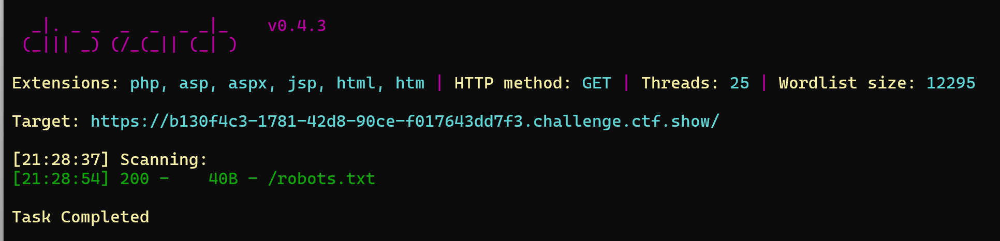

### 利用

浏览器访问 `/robots.txt`

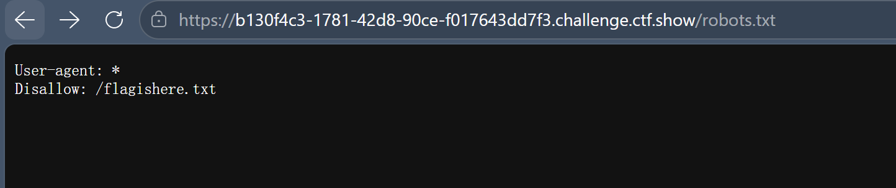

看到`/flagishere.txt`，直接拼接url访问拿到 flag

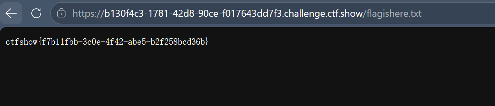

### 总结

robots.txt 本来是限制爬虫爬网站的，但如果被打开就会暴露你想保护的路径

## 二、Web5

### 扫描

不带 `-e` 参数扫不到任何东西，因为默认字典里没有 `.phps` 后缀，题目页面提示了所以手动指定

```
python dirsearch.py -u 你的url -e phps 
```

>带了-e,不带扫不出来

dirsearch 输出

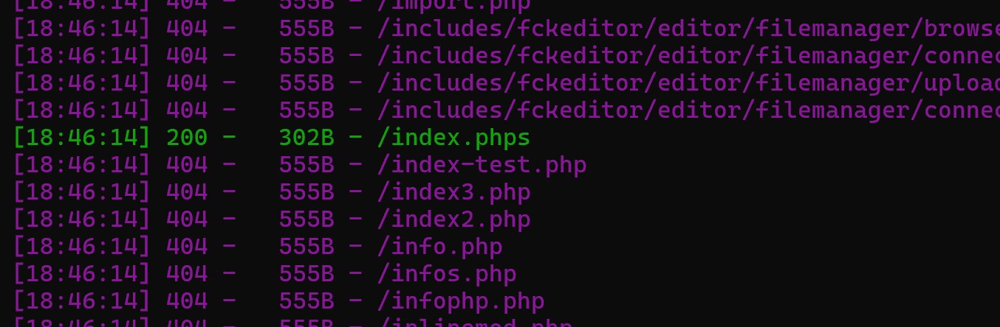

### 利用

浏览器访问 `/index.phps`，flag 就在源码里，直接到手

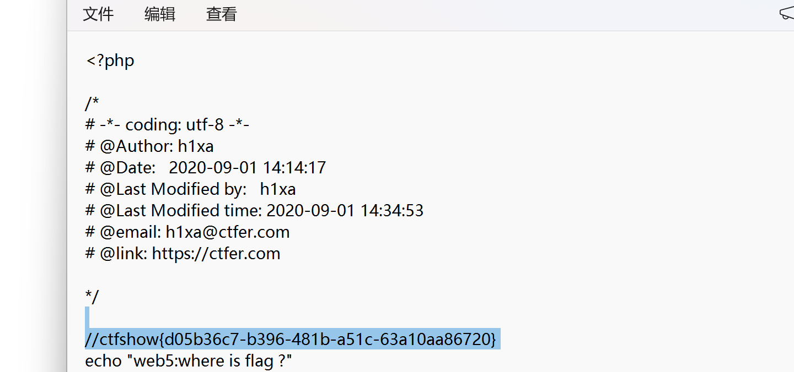

### 总结

这道题的问题在于**不带 `-e phps` 就扫不到**。`-e` 参数决定了扫哪些后缀，默认字典不包含 `.phps`，所以必须手动指定

## 三、Web6

### 扫描

```
python dirsearch.py -u 你的url
```

dirsearch 输出：

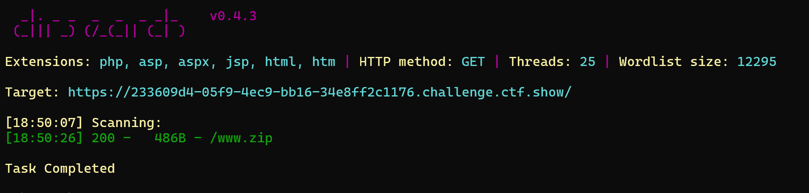

### 利用

1. 浏览器访问 `/www.zip`，下载压缩包
2. 解压，里面有两文件告诉了flag的位置

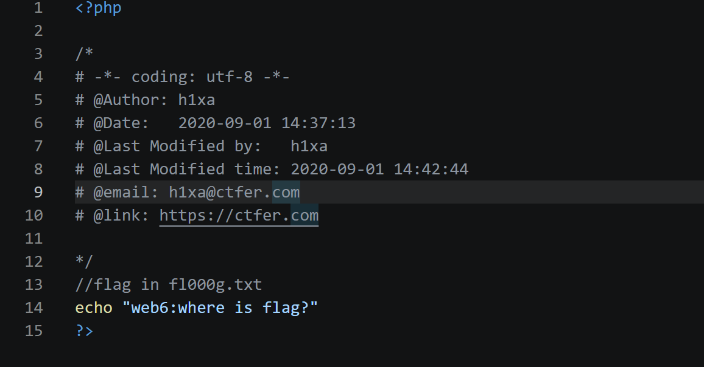

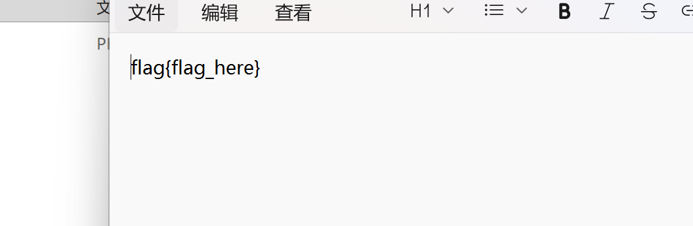

3. 访问`fl000g`，flag有了

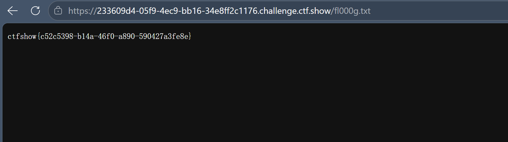

### 总结

好像没什么特别的

## 四、Web7

### 扫描

```
python dirsearch.py -u 你的url
```

>都一样

dirsearch 输出

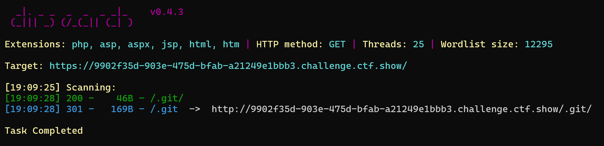

### 利用

访问.git,到手

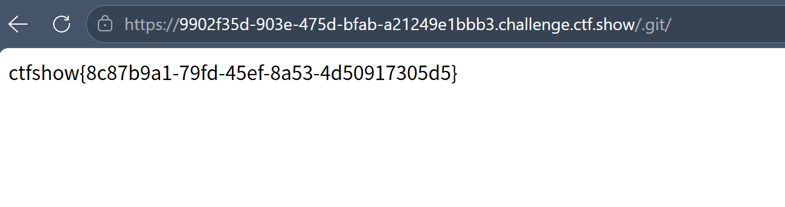

### 总结

看别人wp还要用githack提取，为什么我访问.git直接显示了，直接蒙了

## 五、Web8

### 扫描

```
python dirsearch.py -u 你的url
```

>千篇一律了

dirsearch 输出

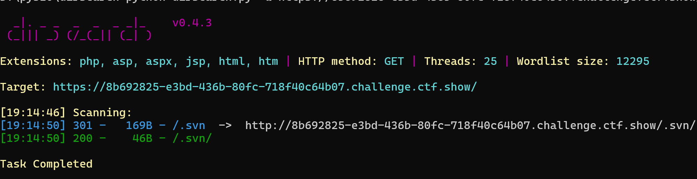

### 利用

访问swn

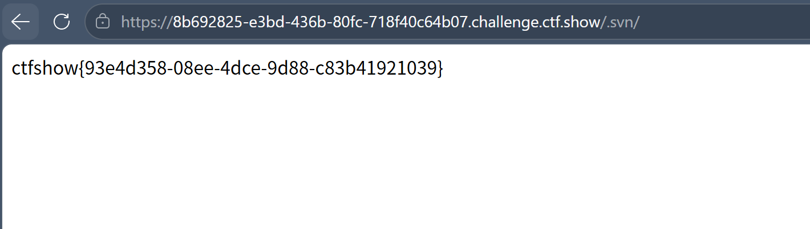

### 总结

查了知道swn是版本控制系统，多个人共同开发一个项目，别人的wp依旧要提取，但我还是访问就给  ？？？

## 六、相同点总结

### 6.1 都是信息泄露

五道题的考点都是**服务器上不该暴露的文件或目录被遗留了**，只是泄露的东西不同：

| 题号 | 泄露类型 | dirsearch 扫什么 |
|------|---------|-----------------|
| Web4 | robots.txt | robots.txt 文件 | 
| Web5 | phps 源码泄露 | .phps 后缀文件 | 
| Web6 | 备份文件泄露 | .zip  文件 | 
| Web7 | .git 泄露 | /.git/ 目录 | 
| Web8 | .svn 泄露 | /.svn/ 目录 |

### 6.2 解题流程都一样

这几道题步骤都是这些：

1. **dirsearch 扫描** — 扫出隐藏路径
2. **访问/下载** — url加后缀
3. **找 flag** — 打开敏感文件找到 flag

### 6.4 核心就一个字：猜后缀

五道题的区别，归根结底就是**扫的后缀不同**，dirsearch 的 `-e` 参数决定了扫哪些后缀，带对后缀就大概率能行

>虽然上面大多用默认的字典就行

## 七、dirsearch用法整理

### 7.1 换路径

命令行cd到你的dirsearch

### 7.2 万能命令

打 CTF Web 入门题，记住这一条就够了：

```
python dirsearch.py -u 你的url
```

- `-e *`：所有内置扩展名，一把全覆盖（全覆盖别当真，还是有很多要自己猜）

### 7.3 常用参数速查

| 参数 | 作用 | 示例 |
|------|------|------|
| `-u` | 目标 URL | `-u https://example.com/` |
| `-e` | 扫描的扩展名 | `-e php,txt,zip,git` |
| `-t` | 线程数 | `-t 20` |
| `-w` | 自定义字典路径 | `-w /path/to/wordlist.txt` |
| `-x` | 排除状态码 | `-x 404,403` |
| `-i` | 只显示指定状态码 | `-i 200` |
| `--timeout` | 请求超时秒数 | `--timeout=15` |
| `-r` | 递归扫描子目录 | `-r` |

### 7.4 针对不同题型的命令

| 题型 | 命令 |
|------|------|
| 通用扫描 | `-e *` |
| 备份文件题 | `-e zip,bak,tar.gz` |
| 源码泄露题 | `-e git,svn,phps` |
| 只看成功的 | `-i 200` |

### 7.5 用好 dirsearch 的核心

`-e *` 用的是 dirsearch 内置扩展名列表，覆盖常见 web 后缀（php、html、txt、zip、git 等），但**不包含冷门后缀**。所以实际策略是：

- **不知道题型** → 先用 `-e *` 全部扫一轮
- **如果扫不到** → 说明目标后缀比较冷门，可以试试手动指定 `-e phps` 等
- **要是知道题型** → 直接指定后缀，速度

## 八、dirsearch本质及个人对于题目和这个工具的思考

### 8.1 题目背后是什么

看到我上面阉割版的wp，或者说有做过的朋友应该明白，这几道的内核其实应该是不同场景下，本不该被访问的文件因为人为疏忽或配置不当暴露在了 Web 目录下，
但我今天想分享的主题实际上是dirsearch这个工具的使用，所以没有太提及漏洞的本质

### 8.2 dirsearch是什么东西

这实际上就是一个自动化猜路径后拼接url尝试访问的脚本，说白了就是一个个试，和Advanced Archive Password Recovery或bp的intruder有异曲同工的感觉，只是作用的地方不同，其中前面提到的字典就是他猜的根据，相当于前人的经验

>就像在工件检测时，人眼很难找到瑕疵，所以往往会倒水看那漏了，程序员不规范操作留下的漏洞就相当于瑕疵，我们很难找到可访问的敏感的路径，但dirsearch这个工具就像是水，帮我们进行一个广泛的排查

### 8.3 使用场景

说实话，当你要用到他的时候，大概率是还没找到题目的入口，但如果服务器藏了东西，扫一下就会有惊喜