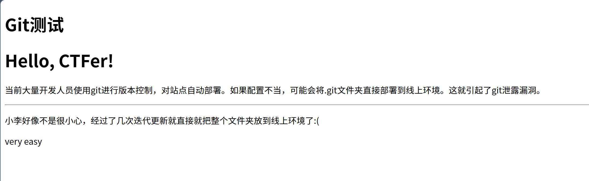
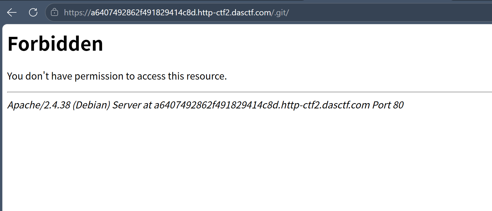
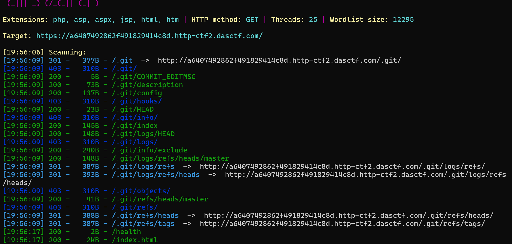
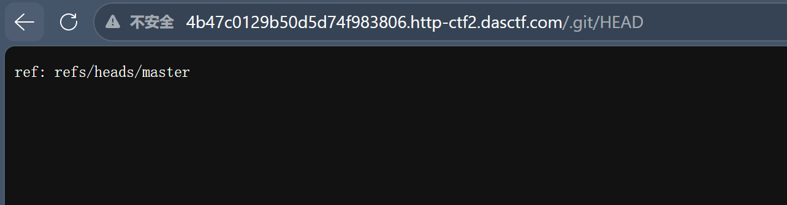
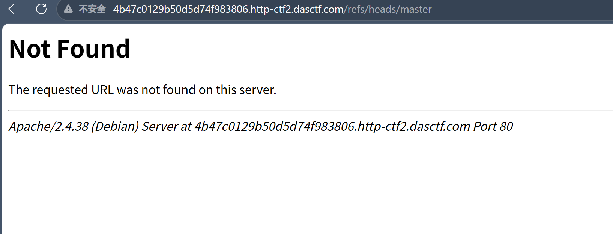
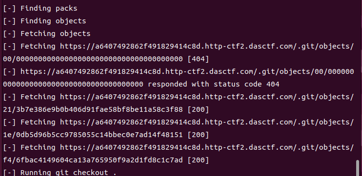
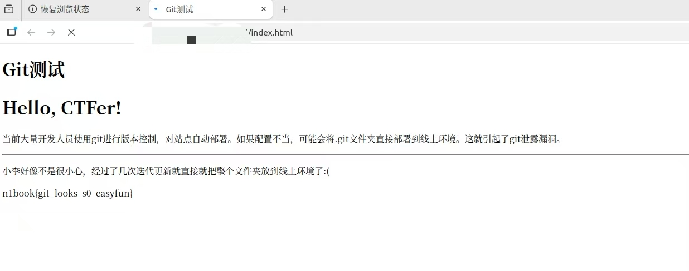

>>题来自buuctf的n1book题单

## 一、开题，粗心的小李

我的靶机地址：`https://a6407492862f491829414c8d.http-ctf2.dasctf.com/`



## 二、WP：从踩坑到解决

### 2.1 老套路，直接访问 .git

之前做 ctfshow Web7 的时候，dirsearch 扫到 `/.git/` 后，直接浏览器访问就给

浏览器直接访问 `https://URL/.git/`，他用最直白，最直接，最不绕弯子，最客观的语言告诉我**403 Forbidden**



> > 这跟 ctfshow 那题不一样啊？说明之前虽然使用dirsearch这个工具找到可访问的路径解决了问题，但并没有理解git泄露这个漏洞的本质，之前的题目只是让我们了解信息泄露到底是什么

还是扫一下试试



OK啊，403 只是禁止列出目录列表，不代表里面的文件访问不了

```
https://URL/.git/HEAD
```

返回了：

```
ref: refs/heads/master
```



其实根据扫路径的结果，就算没有返回这个路径，后面也会去尝试访问它，但是能感觉到他既然返回了一个路径，肯定是一个线索

但访问后只给一串看不懂的东西。这是什么意思？完全不知道该怎么往下走



>>ps:后来才知道，`ref: refs/heads/master` 是 git 内部的引用文件，告诉 git 当前 HEAD 指向 master 分支。但这对于我来说就是一串乱码——所以知道 `.git` 泄露了很重要的信息，但看不懂。。。

### 2.2 查资料：git-dumper

老套路走不通，开始"借鉴",发现git泄露类型的wp中常常用到git-dumper

- **git-dumper**：一个py开源命令行工具，会自动下载整个 `.git` 目录并尝试 `git checkout` 恢复源码

于是装工具试试

### 2.3 用 git-dumper 解决

先安装：

```
pip install git-dumper
```

>>因为是复现，这里没图

然后一条命令下载 + 恢复：

```
python3 -m git_dumper https://URL/.git/ xl（win是python）
```



直接会兴建一个叫xl的文件夹存git文件

### 2.4 找到 flag

打开 `xl` ，里面有一个 `index.html`，打开，flag到手



flag：`n1book{git_looks_s0_easyfun}`

### 2.5 跟 ctfshow Web7 的对比

做完了回头看，这道题其实是 ctfshow Web7 的复杂版本：

| 对比项 | ctfshow Web7 | 这道题 |
|--------|-------------|--------|
| 考点 | .git 泄露 | .git 泄露 |
| 确认方式 | dirsearch 扫到 `/.git/` | 页面直接提示 + 访问 `.git/HEAD` |
| 提取工具 | GitHack | git-dumper |
| flag 位置 | 源码文件里 | 源码文件里 |

核心漏洞一样，区别只在于使用工具，装上git-dumper恢复就好了

## 三、解决过程总结

回顾整个流程，实际操作就三步：
1. dirsearch扫路径
2. **访问 `URL/.git/HEAD`** — 返回 `ref: refs/heads/master`，确认路径
3. **`python3 -m git_dumper URL/.git/ xl`** — 下载 .git + 自动恢复源码
4. **打开文件找 flag**

踩的坑主要是：开始照搬了ctfshow Web7 的套路，但估计之前的题只是想让解题人理解信息泄露，并没有去引导学习具体漏洞的思路，所以在这题上行不通，解决方法是查资料换工具，让人感觉非常典型的漏洞，也会有很多变形

## 四、Git 泄露总结

### 4.1 什么是 git 泄露

用 git 管理代码时，项目根目录下会生成一个 `.git` 隐藏文件夹，里面记录了**完整的版本历史**：每一次提交的内容、修改记录、分支信息、甚至被删除的文件

正常情况下这个文件夹不能被外部访问到，但如果服务器配置不当，就像小李很粗心，把整个项目目录（包括 `.git`）直接放到了 Web 根目录下，攻击者就可以通过 `https://目标URL/.git/` 访问到这些文件，从而**恢复出完整的源码**

### 4.2 .git 目录里有什么

| 文件/目录 | 作用 |
|-----------|------|
| `HEAD` | 指向当前分支（如 `ref: refs/heads/master`） |
| `index` | 暂存区，记录了当前追踪的文件列表和哈希值 |
| `objects/` | 存储所有 git 对象（commit、tree、blob），按哈希值分目录 |
| `refs/` | 分支和标签的引用 |
| `logs/` | 操作日志 |
| `config` | 仓库配置信息 |

其中最关键的是 `index` 和 `objects/`——`index` 展示有哪些文件，`objects/` 存的是文件的实际内容

### 4.3 恢复源码的原理

git-dumper 的工作流程：

1. 下载 `.git/HEAD`，确认 .git 存在
2. 下载 `index` 文件，解析出所有 git 对象的哈希值
3. git 对象的存储路径是 `.git/objects/前2位/后38位`，按这个格式逐个下载
4. 所有对象下载完毕后，执行 `git checkout .` 恢复原始文件

说白了就是：**把 .git 目录完整复制到本地，然后用 git 自己的命令把源码还原出来**。

### 4.4 查的常见的工具

| 工具 | 特点 | 适用场景 |
|------|------|---------|
| **git-dumper** | 自动下载 + 自动恢复，一条命令搞定 | 首选，大多数情况都好用 |
| **GitHack** | 老牌工具，Python 写的 | 备选，某些场景 git-dumper 不行时可以试 |
| **Git_Extract** | 也是下载 + 恢复 | 备选 |

>>ps:工具不用全装，先 git-dumper，不行再换
