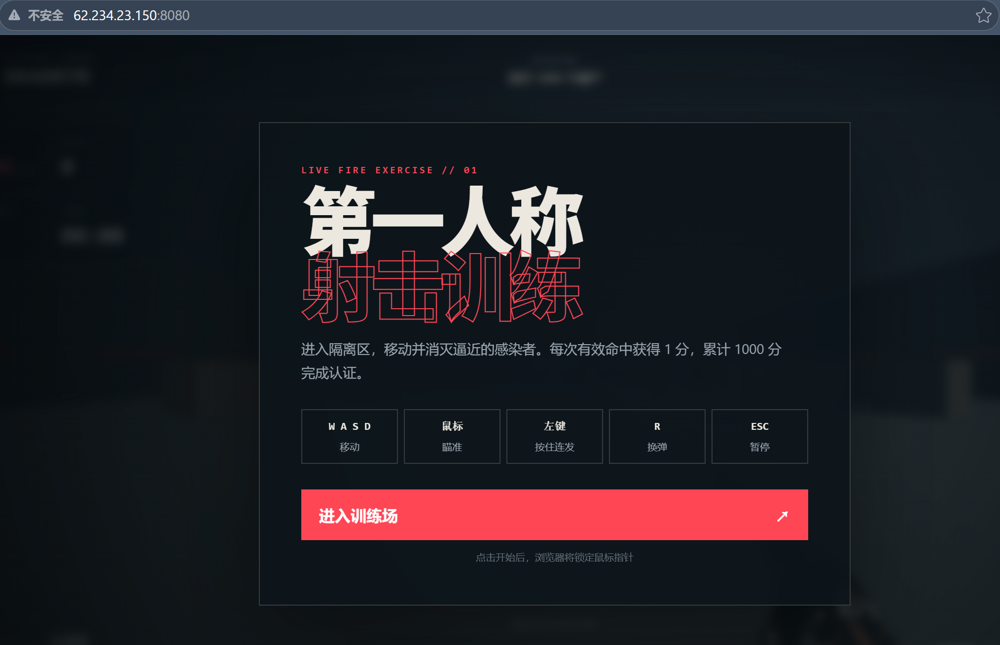
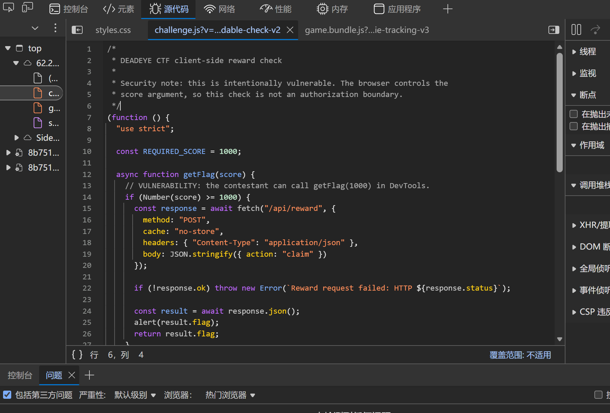
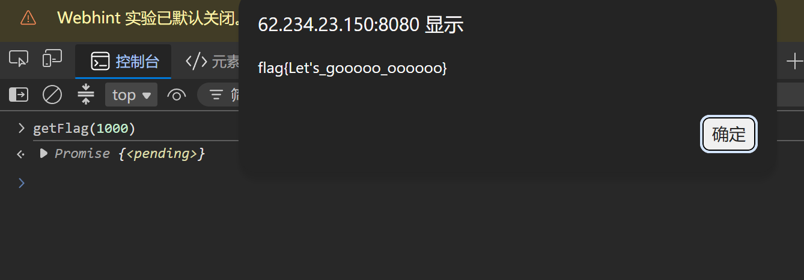

> 这是一道第一人称射击游戏的 XSS 简单题，目标是通过前端漏洞拿到 flag。本文先记录我实际操作的过程，后面再聊我对XSS的一点理解

<!--  **题目地址**：[http://62.234.23.150:8080/](http://62.234.23.150:8080/) -->

## 一、拿到 flag 的全过程

这部分的操作无比直接，几乎不用动脑子，按步骤来就行

### 1.1 打开题目页面

直接在浏览器地址栏输入：

```
题目靶机<!-- http://62.234.23.150:8080/ -->
```



页面加载后会看到一个第一人称射击游戏界面（不要乱想），有个"进入训练场"的按钮。这个游戏就是题目的外壳，真正的考点不在这里面，在网页的代码里

> ps：看到页面不要急着点开始游戏，按设置的移速和血量打不了1000个僵尸……而且这道题根本不需要进游戏

### 1.2 打开浏览器的开发者工具进行代码的审计

按键盘上的 **F12**，或者右键页面任意位置选"检查"，弹出开发者工具窗口

challenge.js无比显眼，直接展示了判定逻辑，并将**getFlag**挂在了window，这意味这你可以直接调用



### 1.3 切换到 Console（控制台）标签页

在开发者工具的顶部标签栏里，找到并点击 **Console**（中文界面可能显示"控制台"）

在这里你可以直接输入 JavaScript 代码，浏览器会当作当前页面里的代码来执行，相当于你临时变成了站长

### 1.4 一行代码拿 flag

在控制台输入：

```js
getFlag(1000)
```

按下回车，控制台会立刻回显一个 `Promise {<pending>}`，同时页面会弹出一个 alert 弹窗，显示：

```
flag{Let's_gooooo_oooooo}
```



flag到手了

> ps：`getFlag` 是一个 `async` 函数，所以它返回的是一个 Promise，控制台里看到 `Promise {<pending>}` 是正常的。但函数内部已经向服务器请求了 flag，并且通过 `alert` 弹了出来，所以不影响我们拿到结果。如果你想在控制台直接看到返回的字符串，可以加上 `await`：
> ```js
> await getFlag(1000)
> ```
> 两种写法效果一样，flag 都能拿到。

### 1.5 拿到 flag 后的样子

控制台里会显示：

```
Promise {<pending>}
```

同时页面弹窗显示：

```
flag{Let's_gooooo_oooooo}
```

到这里，控制台操作路径就全部完成了。整个过程就是：**打开页面 → F12 →审源码 → Console → 一行 getFlag(1000) → 出 flag**

---

## 二、XSS（跨站脚本攻击）到底是什么？——个人的理解

### 2.1 一句话解释

**XSS就是：别人把一段JS代码，偷偷放进你正在看的网页里，然后你的浏览器把它当成"网页自己的代码"去执行了**

这里的关键在于"放进去"三个字

正常的网页，上面的文字、图片都是网站管理员写的。但 XSS 的漏洞点在于：网页上的某些内容，是**从别的地方读来的**（比如 URL 参数、你输入的评论），这些内容本来应该只显示出来，相当与他是死的，但如果网站处理得不好，就会把这些内容里的HTML标签也一起解析了，就有东西可能活过来

浏览器有个默认的信任逻辑：

> 这个页面是example.com给我的，上面所有`<script>`什么的，都是example.com自己放进去的，应该没问题

XSS 就是打破这个信任——代码是攻击者写的，但因为处理不当混进了页面，浏览器分不清，就全照单执行了

### 2.2 为什么叫"跨站脚本"

早期发现这种漏洞时，攻击者通常是利用A网站的漏洞，把恶意脚本放进去，然后受害者访问A网站时，这个脚本实际上去偷A网站的信息发给B网站（攻击者的网站），所以叫**“跨站脚本”**——脚本跨越了不同的站点

### 2.3 本质原因：数据和代码混在了一起

网页里有两类东西：

- **数据**：用户名、评论、搜索词……这些本来应该只给你看，不执行（可以把它理解为一种静态的东西，不会产生什么风险）
- **代码**：`<script>`、事件处理函数……这些是浏览器要执行的指令（相反于数据可以理解为动态，会有动作，产生行为）

当程序把用户的数据，**不加转义**地混进 HTML 里时，数据里的 `<`、`>` 这些符号就会被浏览器当成"代码标记"来解析。就像把一具尸体运进了安全屋中，本来看着没有任何问题，但进到屋内后尸体诈尸了，尸体就会有自己的行为，此时安全屋内的人就危险了。比如：

```html
<script>alert(1)</script>
```

如果 `script` 部分是从用户输入里来的，而网站直接把它原样拼到了页面上，那浏览器看到 `<script>` 就会执行里面的代码——这就是 XSS

### 2.5 本题中的 XSS 和"控制台解法"的关系

这道题实际上有两个漏洞叠加在一起：

1. **DOM 型 XSS**：`player` URL 参数的值会被不加过滤地写进 `innerHTML`，导致可以通过 URL 注入 HTML 标签执行任意代码
2. **客户端授权问题**：`getFlag` 函数被挂在全局，且分数检查在前端，任何人都能调

本题利用的是getFlag函数被挂在全局，好处是自己浏览器里一行搞定；而 XSS 解法利用的是通过 URL 注入代码，好处是可以构造一个链接发给其他人，任何人点了链接都会中招。这就是 XSS 比"自己开控制台"更危险的地方——**它能攻击别人**

> ps：DOM-XSS的解法还没想好怎么说，后面会补

---

## 三、XSS 的分类

XSS 按照"恶意代码是怎么到达用户浏览器的"，分成三大类

### 3.1 反射型 XSS（Reflected XSS）

**原理**：恶意脚本藏在 URL 参数里，服务器收到请求后，把参数原样"反射"回 HTML 响应。特点是：
- 脚本不在服务器上存留
- 受害者必须点击那个特定的恶意链接
- 服务器参与了"把参数拼进 HTML"这个过程

**典型场景**：

点击了来源不明的链接后，会跳转到目标网站，但是url本身带毒，会在你的浏览器以你的权限进行危险操作

### 3.2 存储型 XSS（Stored XSS）

**原理**：恶意脚本被**存进了服务器的数据库**，之后任何访问这个页面的用户都会中招，这个最阴了

**典型场景**：

评论区、论坛帖子、个人简介等地方，攻击者提交一段包含恶意脚本的评论，服务器把它存进数据库，之后所有用户浏览这条评论时，浏览器都会执行那段脚本

**和反射型的区别**：
- 反射型是"一次性的"，要点链接才会触发
- 存储型是"持续的"，一次注入，所有访问者都中招

### 3.3 DOM 型 XSS（DOM-based XSS）

**原理**：整个攻击过程**不经过服务器**，服务器返回的 HTML 本身是正常的、干净的，但页面里的前端 JavaScript 代码自己从 URL 读参数、自己写进 DOM，导致了 XSS，这里服务器就像无能的丈夫，只能眼睁睁看着网页被侵犯

**典型场景**：

本题就是，前端JS直接读了参数写DOM

## 四、总结

这道题虽然是XSS简单题，但其实覆盖了两个非常典型的知识点：

1. **DOM 型 XSS 的漏洞模式**
2. **前端授权不可信**：把"分数检查"放在浏览器里，等于没检查，任何人都能直接调 `getFlag(1000)` 拿 flag

控制台解法利用一行代码就能拿到 flag；而真正的 XSS 攻击通过构造特制 URL 让别人的浏览器也中招。理解这个区别，就理解了 XSS 为什么值得专门去防

>话说作者不会是Zmjjkk串子吧